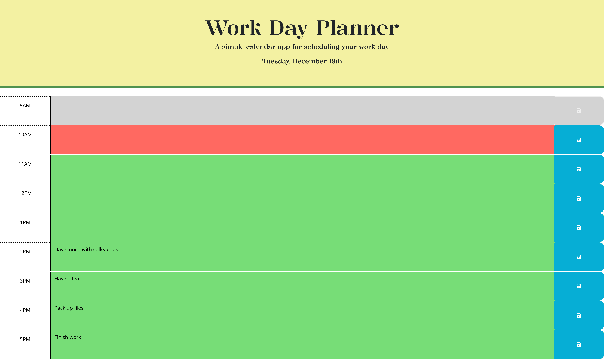

# Work Day Planner 
The Work Day Planner is an application where schedules for office hours of a given day can be saved and updated.

## Description
This application lets an user save a schedule for every hour of office hours (9AM - 5PM) of the current day. It is a single day scheduler, so the user can schedule tasks for that day only. The time blocks/hours are colour-coded. The past hours are grey and disabled, whereas the present hour is red and the future hours are green.
The user can type his/her schedule in the column next to the hour column. The schedules can be stored and edited as required, but only one schedule is allowed for the given hour. The schedules can be saved by pressing the save icon in the right-hand side column. The schedules are stored in the *Localstorage*, so when the program is reloaded, the schedules persist and are rendered.

This application was created as a coding challenge assignment while doing a coding bootcamp at the University of Sydney in 2023. The following user story and acceptance criteria demonstrate its requirements:
### User Story
    AS AN employee with a busy schedule
    I WANT to add important events to a daily planner
    SO THAT I can manage my time effectively
### Acceptance Criteria
    GIVEN I am using a daily planner to create a schedule
    WHEN I open the planner
    THEN the current day is displayed at the top of the calendar
    WHEN I scroll down
    THEN I am presented with time blocks for standard business hours of 9am to 5pm
    WHEN I view the time blocks for that day
    THEN each time block is color-coded to indicate whether it is in the past, present, or future
    WHEN I click into a time block
    THEN I can enter an event
    WHEN I click the save button for that time block
    THEN the text for that event is saved in local storage
    WHEN I refresh the page
    THEN the saved events persist
## Demo
The following animation demonstrations the application's functionlity:

## Features of the application
-  _JQuery_ for dom manipulation
-  *Bootstrap* for styling the page
- *CSS* for custom styling 
-  *DayJS* for date and time manipulation
-  *Google Fonts* for text
-  *Fonts Awesome* for icons

## Starter Code
The application uses the starter code from the following link:     
[Link to Starter Code](https://github.com/coding-boot-camp/crispy-octo-meme)

## Caution
Day.js is a lightweight alternative to Moment with almost the same functionality. But to use date ordinal (31st, 17th, etc), the AdvancedFormat plugin is required to be downloaded to the application package like below:

## Link to the deployed application
[Link to deployed Work Day Planner application](https://simplesuyash.github.io/work-day-planner/)

## Same application, different method
For learning purpose, I initially tried the other method of creating the application. The other application maybe less complicated syntax and concept wise, but involves a lot of dom traversing.      
[Link to deployed Work Day Scheduler application](https://simplesuyash.github.io/work-day-scheduler/)   
[Link to Work Day Scheduler repo](https://github.com/SimpleSuyash/work-day-scheduler)   